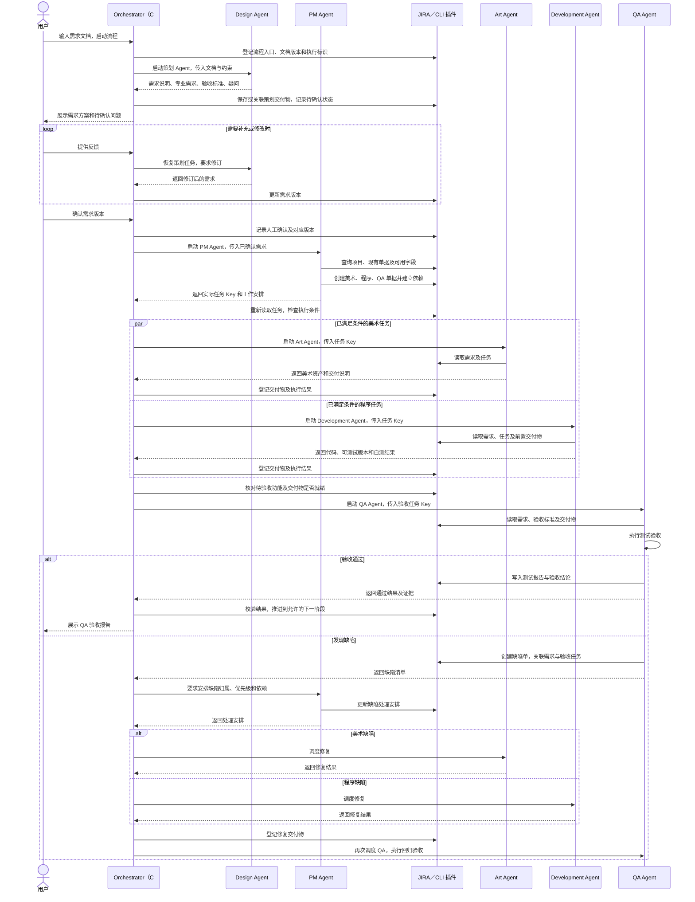

# GameCLI 多 Agent 游戏开发流程指导纲要

## 最新讨论约定（2026-09-24，待实现）

本节优先于下文冲突的历史基线，详细设计见[方案 v1.1](GameAI云端编排与Codex协作平台设计方案.html)。

- 后续开发以本节和云端协作设计方案为指导：直接扩展现有 GameCLIServer，服务端采用 Node.js + TypeScript，负责审批、依赖、租约和派工；不再新建 Python 编排服务。新增模块使用 TypeScript，现有 JavaScript 逐步迁移。C#/.NET GameCLI 保留，负责本地 Agent 执行，JIRA 仍为业务状态唯一可信来源。技术方向已确认，新增能力待实现。
- Codex 对话负责需求讨论与修改，扩展 UI 完整展示需求。人工点击“批准此版本并启动流程”，绑定需求版本、文件哈希与真实批准者，服务成功写入 JIRA 才显示已批准。
- 主任务需求附件先上传并核验，最多三次；之后云端选择空闲且具备 PM 能力的 GameCLI，由其内部 PM Agent 按交付标准拆分、通过确定性适配代码建单。
- GameCLI 回报真实单号及计划版本，云端重新检查 JIRA 的父子关系、依赖、附件及版本，再自动寻找空闲专业 GameCLI 启动依赖就绪任务，无需建单后重复下令。人工抽检、最终验收及发布门禁继续保留。
- GameCLI 使用后台常驻主进程，通过 WebSocket 注册节点、上报容量、心跳续租、接收任务并确认、回传进度和接收取消指令；每项任务独立 Agent 会话，完成后继续等待。HTTP 用于需求提交、详情查询、文件上传、最终结果提交与断线核对；一次性命令仍保留。HTTP 长轮询不列入首版必做项。
- 派工必须先在 JIRA 持久化分配与租约，再通知节点；有效租约核验与接单确认后才启动 Agent。重复消息不得重复启动，结果提交必须幂等；断线重连核对未结束执行，失联不立即重派，旧租约代次不得推进任务。WebSocket 发送成功不等于业务成功。
- 关闭看板或结束聊天不停止后台执行端；暂停接单不等于取消当前任务。首版单调度实例支持多执行节点，不承诺多活互斥。
- 本期不接入、调用 Unity CLI，也不以 Unity 环境作为启动前置条件；聚焦 UI 审批、PM 建单、Agent 启动、状态回传和 JIRA 核验。未运行的开发／验收不能标为完成。
- 当前 Codex 存在 MCP App UI 和侧方面板实现，但账号开关、自建组件、审批交互仍需最小示例实测。


确认日期：2026-09-23

文档状态：已确认的目标流程，作为后续开发依据；不表示所述能力均已实现。第一阶段已接入由 Codex 对话调用的 CLI，Orchestrator 面板仅保留运行监控，使用方式及当前限制见 [Orchestrator 工作流说明](../app/client/LocalPackages/com.oathx.gamecli/Docs/orchestrator-workflow.md)。

## 1. 目标与适用范围

用户输入需求文档，由独立策划 Agent 提炼为可执行开发需求，经用户确认后，由 PM Agent 在 JIRA 创建和组织美术、程序及 QA 单据。Orchestrator 根据依赖调度各专业 Agent，推进制作、测试和缺陷回归，最终交付 QA 验收结果。

本纲要适用于 `ugame-ai-cli` 的 CLI、Unity 工具面板、Agent 适配、角色 SKILL 和 JIRA 集成开发。

本文件是对[全 AI 流程规划纲要](全AI流程规划纲要.html)的流程修订。在角色数量、需求分析归属及调度链路上，以本次确认的“五个专业 Agent + Orchestrator”为准：原先由 PM 承担的需求提炼和玩法设计迁移给 Design。原纲要及现有 SKILL 中仍保留的四类业务角色描述，需在对应功能开发时同步更新；其余兼容约束继续适用。

## 2. 总体原则

1. 五个专业角色为 Design、PM、Art、Development、QA，分别使用独立 Agent 执行。
2. Orchestrator 是统一调度入口，核心为 C# 流程引擎；不要求额外启动一个 LLM Agent 决定所有流程步骤。
3. JIRA 是任务状态、审批、依赖、执行记录和重试记录的唯一可信来源。不得引入 SQLite、本地 JSON 或第二套数据库保存权威流程状态。
4. 专业 Agent 不直接启动其他 Agent，由 Orchestrator 统一管理生命周期和阶段推进。
5. AI 不能自行批准需求，也不能把旧版本的人工批准用于新版本。
6. 进程结束、模型声称完成或 CLI 返回已受理，都不能单独作为业务完成依据。必须核对真实单据、交付物及验收证据。
7. CLI 命令实现 `ICommand`，插件实现 `ICLIPlugin`，遵守 enable/disable；编排内部调用不能绕过插件开关。
8. 所有业务和工具实现使用 C#，遵守工程现有编码规范和职责分层。

## 3. 角色与职责边界

| 角色 | 负责内容 | 主要交付物 | 职责边界 |
|---|---|---|---|
| Design／策划 | 阅读文档，设计玩法和规则，补齐边界条件，定义验收标准 | 需求说明、美术需求、程序需求、验收标准、待确认问题 | 不代替 PM 管理项目，不自行批准需求，不直接制作正式资产或代码 |
| PM／项目管理 | 根据已确认需求组织单据、优先级、角色分派和依赖；跟踪进度并协调变更 | 实际 JIRA 单据、依赖关系、工作安排、进度与阻塞分析 | 不自行决定玩法规则，不代替编排器管理 Agent 进程 |
| Art／美术 | 按美术任务制作和修改资源 | 美术资产、资源清单、交付说明和检查结果 | 不自行扩展需求或启动程序 Agent |
| Development／程序 | 按任务实现功能、集成资产、完成必要自测 | 代码、可测试版本、自测结果和实现说明 | 不自行改写需求；自测不代替 QA 验收 |
| QA／测试验收 | 按需求和验收标准设计用例、执行测试、记录缺陷和回归 | 测试用例、缺陷单、证据、验收报告 | 不自行修改需求或直接实现业务修复 |
| Orchestrator／编排器 | 阶段检查、Agent 调度、输入交付、结果校验、并发控制、取消、超时、恢复及人工关口 | 流程推进和执行记录 | 不代替专业角色做设计、项目安排或测试结论 |

PM 负责“工作如何组织和跟踪”，Orchestrator 负责“何时启动谁、交给它什么、何时允许进入下一步”。例如 PM 定义界面接入依赖 UI 资源和数据接口；Orchestrator 检查两项交付就绪后，才启动对应程序任务。

## 4. 从输入到 QA 验收的调用链



图中所有 JIRA 访问经 GameCLI 的 JIRA 插件或其共享服务执行。Agent 发起受控工具请求，C# 校验参数、执行调用并返回真实结果，凭据不进入 Agent 提示词。

Art 与 Development 仅在各自前置条件满足时并行，并非固定同时启动。需求冲突、规则缺失等问题转回 Design 澄清，不应直接归类为程序缺陷。混合缺陷可拆成多个相关任务，分别调度后统一回归。

## 5. 阶段输入、输出与进入条件

| 阶段 | 输入 | 必须产生的输出 | 进入下一阶段的条件 |
|---|---|---|---|
| 文档接收 | 文档、目标工程、已配置的 JIRA 项目 | 流程入口、文档版本、执行标识 | 文档可读、项目有效、入口登记成功 |
| Design 需求设计 | 文档、约束和用户反馈 | 明确规则、边界条件、专业需求、验收标准、疑问 | 输出契约有效，阻塞问题已明确列出 |
| 需求确认 | 指定版本的策划交付物 | 绑定需求版本的人工确认记录 | 阻塞问题已解决，用户确认该版本 |
| PM 任务组织 | 已确认的需求版本 | 美术、程序、QA 单据 Key、分派和依赖 | 必要单据存在且关联完整，无循环依赖 |
| Art／Development 制作 | 任务 Key、需求版本及前置交付物 | 可定位的资产或代码、自检／自测结果 | 当前任务交付有效，满足后续任务约定 |
| QA 测试验收 | 验收任务、需求、标准、待测版本 | 测试报告、结论、证据或缺陷 Key | 对应版本验收通过；失败进入修复或澄清流程 |

QA 单据在 PM 建单阶段创建；验收执行等待对应功能具备可测试条件。QA 可以提前设计测试用例，但不能对尚未交付的版本记录测试通过。

策划交付必须能指导执行。例如“增加背包系统”至少要澄清容量、堆叠规则、满包行为、交互流程、资产需求及可验证的验收条件。不得把未确认的模型假设写成已批准规则。

## 6. JIRA 数据归属和交接契约

### 6.1 流程入口与专业单据

Orchestrator 通过 JIRA 插件登记技术性的流程入口，用于关联原始文档、执行标识和后续记录；此操作不承担业务任务拆分。PM 在需求确认后负责创建和组织专业工作单据。

流程入口可以采用项目允许的普通单据类型。首版专业单据也可以统一使用 Task，以明确的角色分类区分美术、程序和 QA；不强制预先安装 Epic、Story、自定义单据类型或特定插件。

每项工作必须可追溯到来源需求及其版本。文档和资产可以放在附件、版本库或资产存储中，但 JIRA 必须保存可定位、可校验的引用；仅存在于本机的临时文件不能成为其他 Agent 唯一的交接依据。

### 6.2 最小交接信息

| 对象 | 至少包含的信息 |
|---|---|
| 工作流 | 流程标识、入口单据 Key、目标项目、文档版本、当前阶段、人工确认及执行记录 |
| 策划需求 | 稳定需求标识、说明、规则与边界、专业需求、验收标准、待确认问题 |
| 专业任务 | 单据 Key、角色、来源需求版本、工作描述、验收标准、依赖和执行标识 |
| Agent 执行 | 执行标识、角色、任务 Key、输入版本、开始／结束时间、结果、错误及重试记录 |
| 交付物 | 类型、位置、版本或校验标识、所属任务、交付说明及验证证据 |
| QA 结果 | 被测版本、验收标准对应结果、证据、缺陷 Key、通过／失败／阻塞结论 |

以上是逻辑契约，不表示对应 JIRA 自定义字段已存在。实现时可选择字段、标签、属性、描述或附件等合适载体，并验证实际项目权限和字段配置。

面板中的实时进程数量和运行进度可以来自本地运行时信息；任务是否完成、审批是否有效以及是否允许继续，必须以 JIRA 为准。本地日志和缓存只辅助显示和排错。

## 7. 编排、异常和变更规则

### 7.1 调度与完成判断

- 每次派工前读取最新任务、需求版本、审批、依赖及插件状态。
- 为执行设置超时、取消和并发限制，避免重复调度同一任务。
- 已分派的同一任务应有可校验的执行占用机制；“先查询、后写入”不是原子锁。首版若尚无跨实例互斥能力，应明确限制为单调度实例。
- 子进程结束后校验结构化输出、真实 JIRA 结果和交付物，不能仅凭退出码推进。
- JIRA 不可用或回写失败时暂停阶段推进，保留待核对信息；恢复后核对远端事实。
- 业务状态转换映射到项目实际提供的 JIRA workflow 和 transition，不硬编码假定存在的状态名称。

### 7.2 重复执行与恢复

- 导入和任务创建使用稳定的执行标识及任务标识，并在创建时尽可能一并记录。
- 建单超时或响应丢失时，先在 JIRA 核对是否已创建成功，再决定后续动作；不能盲目重复创建。
- 部分建单成功时保留已成功的 Key，只恢复未完成部分；依赖尚未建完整的任务不能提前派工。
- 从 JIRA 恢复任务与阶段；Agent 会话可恢复则恢复，否则用同一已登记任务和明确的新执行记录重新启动。
- 按工程现有约定设置重试上限，默认最多 3 次，并区分网络重试与业务修复。权限失败、规则缺失、结果不确定或次数超限应返回明确阻塞原因。

### 7.3 缺陷、需求变更与人工关口

- QA 记录真实缺陷及证据；PM 安排归属和处理顺序；Orchestrator 调度对应角色修复，再调度 QA 回归。
- 规则不清或需求冲突交回 Design；Design 修订后需要用户确认，PM 再更新受影响单据、依赖和验收范围。
- 已确认需求变更后，暂停受影响的后续派工，明确进行中任务的取消或重新验证安排。不得继续沿用旧审批或旧 QA 结论。
- 用户按整体需求方案确认，无须逐条手工填写任务；人工验收、合并和发布等关口继续按原纲要执行。
- QA 通过仅表示指定版本满足验收标准，不自动授权合并或发布。

## 8. CLI、面板和 SKILL 的后续实现方向

### 8.1 CLI 与 C# 分层

- 用户入口为 Codex 对话，助手调用 Orchestrator CLI 启动完整流程；Design、PM 等命令保留独立执行和诊断能力。
- 命令仅处理参数、调用用例及映射结果；核心状态机和调度放在 C# 编排层。
- Agent 适配负责启动 Codex、传入角色 SKILL、任务上下文和受控工具，读取输出并管理会话。
- JIRA 插件提供查询、创建、更新、关联及状态转换等能力。内部复用服务不要求每张单据都启动一个 CLI 子进程，但必须保留统一的插件开关与校验。
- 机器可读输出包含真实单据 Key、执行标识、阶段、结果和错误；诊断信息与标准 JSON 输出分离。

第一阶段已实现 orchestrator 的 start/status/approve/resume/revise 命令、独立 Design/PM 会话和受控建单工具。后续制作与 QA 调度仍按本纲要开发；具体参数和当前边界见工作流说明。

### 8.2 工具面板

面板分类为 Orchestrator、Design、PM、Art、Development、QA。Unity 分页已移除，Unity CLI 和桥接能力继续作为底层工具使用。Design 标签页已添加，其独立策划命令仍待实现。

- Codex 对话：接收文档、调用 CLI 启动／恢复、展示策划结果、收集用户确认并返回单据链接。原始需求文档输入不放在 Unity 面板。
- Orchestrator：运行中 Agent 与任务监控，不提供手工文档输入或审批操作。需求说明、待确认问题、版本审阅和确认在 Codex 对话中完成；Design 页保留策划命令分类。
- PM：JIRA 配置、任务组织、依赖、进度与缺陷安排；已移除手工建单表单，后续通过 PM Agent 组织建单。
- Art、Development、QA：展示对应角色任务、交付结果及检查证据。

### 8.3 角色 SKILL

新增独立 `gameai-design/SKILL.md`，继续使用包内 `game-cli` 作为可分发技能根目录。Design、PM、Art、Development、QA 与 Orchestrator 各自有标准 `SKILL.md`。

迁移现有 PM 的文档分析职责及对应提示词到 Design；PM 改为消费已确认需求。同步 common 和相关角色技能的输入输出、职责边界、JIRA 约束及交接规则。SKILL 是指令文件，不代表一个常驻 Agent 服务。

## 9. 实现顺序与验收标准

以下为目标开发顺序，具体已实现能力以代码和验证结果为准。

| 阶段 | 开发内容 | 验收标准 |
|---|---|---|
| 第一阶段：文档到单据 | Design 独立 Agent、需求确认、PM 独立 Agent、受控 JIRA 工具调用、Orchestrator 串联 | 输入 Markdown／TXT 后得到可确认需求；确认后自动创建美术、程序、QA 单据并返回真实链接；不会直接派工制作 |
| 第二阶段：调度与交付 | Art／Development 调度、依赖检查、交付契约、实时监控 | 仅就绪任务可启动；并行不违反依赖；交付物可追溯；取消、失败、插件禁用行为明确 |
| 第三阶段：QA 闭环 | QA 执行、缺陷记录、PM 安排、修复与回归 | 能从指定版本生成验收报告；失败能按归属修复并重新验收；需求问题回到 Design |
| 第四阶段：恢复和扩展 | 更完整的字段、单据类型、文档格式、并发与恢复能力 | 中断恢复不重复建单、不重复执行、不使用过期审批；扩展保持同一职责模型 |

最小版本也必须处理真实结果校验、部分成功、建单结果不确定和基础重复执行防护，不能等到第四阶段才处理这些问题。

首版优先支持 Markdown／TXT；PDF、Word 等文档解析作为后续独立能力。代码、面板和文档中必须区分“已实现”“待实现”，不能以空命令、假成功或模型生成的任务 Key 代替真实联通验证。

完整链路的开发验收至少覆盖：需求未确认禁止派工、依赖未满足禁止执行、插件禁用、建单部分失败及超时核对、Agent 超时与取消、JIRA 不可用暂停、需求版本变更、QA 缺陷回归以及人工关口不可绕过。

## 移动平台与单据登记补充（2026-09-23）

- 所有新需求严格限定移动触屏平台，禁止桌面交互方案。
- 单据正文仅包含明确开发内容；问题在对话处理，不渲染未决事项或建议章节。
- 测试用例按用例名称、前置条件、操作步骤、预期结果分层，每项独立一行。
- 策划产出明确美术需求后，立即通过项目管理建单通道登记一张汇总美术需求单据，先于整体需求审批。后续项目管理计划原样复用该任务和真实编号；程序与测试需求同步登记，执行工作仍保留版本审批。
- 建立单据不代表已派工制作。修订时更新原美术单据；移除美术需求时标明原范围已移除。响应未知时查询恢复，不重复创建。
- 专项规则分别由单据编写技能与移动平台需求技能维护，角色主技能引用，宿主显式加载。

### 各专业同步登记

策划产出的美术清单、程序清单和验收用例分别生成美术、程序和测试汇总单据，没有对应内容则跳过。使用稳定任务标识，程序依赖美术（如有），测试依赖程序及美术。根单据展示全部真实编号，后续项目管理完整计划复用这些任务，修订更新原单据。程序和测试登记状态位于 early_tasks 属性，部分创建失败或结果未知时逐项恢复，禁止重复提交。

## 默认任务层级

每份需求登记为一个主任务；策划产出的美术、程序开发、测试验收需求立即登记为该主任务下的真实子任务。子任务使用项目配置的子任务类型与父任务字段，描述链接不能替代层级。父子关系表示归属，依赖仍单独记录。恢复时核对项目、类型、父任务和稳定标签，错误父任务或旧独立任务必须先修正，不自动新建替代。已有单据通过 Jira 转换流程保留编号与内容。

单条命令支持 `jira --create --parent <主任务编号>`；省略父任务创建主任务。配置缺少子任务类型时明确失败，不降级为独立任务。

## 专业调度与交付门禁（已实现）

专业链路为：美术交付并抽检完成 → 程序交付校验完成 → 测试验收交付 → 用户最终验收。无美术需求直接开发。登记单据不表示批准执行；必须已有对应需求版本审批及完整专业计划。

```powershell
GameCLI.exe orchestrator --gates --issue AI9527-1 --project <工程目录> --format json
GameCLI.exe orchestrator --dispatch --issue AI9527-1 --project <工程目录> --format json
GameCLI.exe orchestrator --dispatch --issue AI9527-1 --project <工程目录> --retry-task <子任务编号> --format json
```

- `gates` 只读核验，输出逐项原因；`dispatch` 只启动符合条件的专业代理，默认串行，遇到审核或阻塞停止。命令由对话助手调用，不需要 Unity 面板输入。
- 每次读取最新原生完成状态、父子身份、需求批准、依赖版本和交付清单。文件必须在当前工程内，存在且非空，实际哈希匹配，检查证据属于本次清单。完成文字或单独的完成状态不足以放行。
- `gamecli.delivery.v1` 位于各子任务，记录执行编号、会话、次数、需求与任务版本、上游交付版本、文件哈希、检查证据、提交版本与时间。实际文件保存在工程；本地不保存权威任务状态。
- `CodexWorkflowAgent` 为美术、程序、验收分别启动独立会话，使用工程写入沙箱与本地工具。继承的外部工具仍禁用；工具不足时报告阻塞，不能编造交付。程序角色加载 gameai-dev，宿主显式加载交付、编码与 Unity 规范。
- 代理返回通过后，宿主复核输入与文件，再提交到 JIRA。美术保留人工抽检，完成美术子任务后再次调度；程序校验通过后由编排器自动完成程序子任务并继续启动验收，不增加程序人工审批。最终验收保留人工关口；文件完整性检查不能替代语义、视觉或玩法验收。
- 返工先重新打开单据；上游被重新打开、产物改变或提交新版本，会阻塞下游旧交付。失败或失效任务通过 retry-task 显式重试，累计最多三次。运行中或写入结果不确定的任务先核实，不自动重启。
- 本版按调用推进，无后台轮询，不创建原生阻塞链接，不支持跨机器并发控制、自动缺陷拆单和跨需求的变更审批。运行中断且无法回写时明确保留阻塞，需要核实原进程及远端记录后人工处置。

状态包含 ready、blocked、running、failed、stale、waiting_review、complete，中文原因同时返回。gates 读取成功返回 0；dispatch 未走完整条审核链返回 3，并给出当前审核或阻塞位置，不能把它理解为已经完成背包开发。

新增 `GameCLI.DeliverySmoke` 验证依赖、审核门禁、上游返工、文件变更、输入版本变化、失败重试、权限与不确定写入；`GameCLI.WorkflowSmoke --professional-only` 验证三类专业会话的技能、沙箱、工具权限与结构化返回。模拟测试不代表真实美术生成或 Unity 验收完成。

专项规范见包内 `game-cli/gameai-task-delivery/SKILL.md`，项目管理、编排器及各专业主技能共同引用。

## 集中协调服务方案

团队模式采用 Node.js GameCLIServer 接收 JIRA Webhook，由服务端统一编排并通过固定协议分配给指定执行端，C# GameCLI 负责本地操作。JIRA 继续作为唯一可信来源；通信缓存与连接信息不是第二套业务状态。

当前已实现 Webhook → 服务端 → Orchestrator WebSocket 的事件通道，包括项目订阅、鉴权、心跳、重连与有限补发。集中派工、执行租约、自动重新核对和结果回写尚未实现。观察客户端不能因收到事件自行启动代理。详见 [GameCLIServer 架构与协议](gamecli-server-architecture.md)，以此文档区分当前能力与后续阶段。
