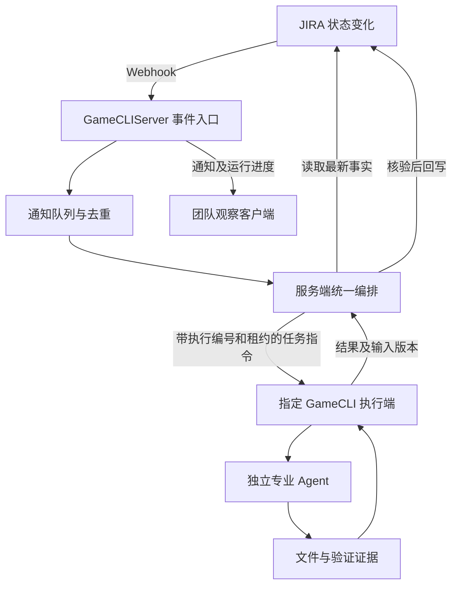

# GameCLI 集中协调服务与事件协议

## 1. 目标与技术选择

团队使用一个 GameCLIServer 接收 JIRA 主动通知，通过固定协议连接多个 GameCLI 客户端。团队模式的编排决策集中在服务端，客户端负责实际工程操作，避免同一事件触发多个独立编排器重复派工。

- 服务端：Node.js，源码位于 `app/client/LocalPackages/com.oathx.gamecli/GameCLI~/GameCLIServer`。
- 客户端：保留 C#/.NET 8 CLI，在 Orchestrator 插件内提供 WebSocket 连接命令。
- 连接：HTTP Webhook 接收 JIRA 事件，WebSocket 连接执行端及观察端；不让每个客户端定时查询 JIRA。
- 状态归属：JIRA 是需求、审批、依赖、执行记录及交付版本的唯一可信来源。通知缓存、连接列表和消息游标只是通信信息，不构成另一套任务数据库。
- 工程现有目录为 `GameCLI~`，不是 `GameCLI/~`。Node.js 服务是用户明确指定的服务端技术例外，CLI 与 Unity 集成继续使用 C#。

## 2. 最终调用链与职责



| 组件 | 职责 | 边界 |
|---|---|---|
| 事件入口 | 验证通知、提取必要字段、排队并快速响应 | 不能在 HTTP 请求内等待 Agent 执行 |
| 统一编排 | 核对审批、依赖、交付，分配任务，核验并回写结果 | 不能将通知正文直接视为最新任务状态 |
| 执行端 | 注册能力与工程，接收自己的任务，启动代理，回传证据 | 不独立决定全局派工、不自行批准需求 |
| 观察端 | 接收事件与进度并展示 | 收到状态变化不代表获得执行权 |
| 专业代理 | 完成 Art、Development 或 QA 的专业工作 | 不直接修改执行租约或启动其他代理 |

现有 C# 单机编排仍可使用。服务端集中派工需要后续在 Node.js 中实现调度模块，C# 端保留本地文件校验和执行适配；不能直接让多个客户端收到通知后同时调用现有 `--dispatch`。跨语言共享固定协议及契约测试，不假设 Node.js 可以直接加载现有 C# 核心。

## 3. 当前已实现范围

当前版本实现的是**事件通道和显式只读 ART 联调**：

1. Node.js 接收 JIRA 的单据创建、更新和删除通知。
2. 按开放项目过滤，只转发单据编号、父任务编号、时间、状态与状态变更摘要，不广播完整需求、评论、人员信息或凭据。
3. C# Orchestrator 通过 WebSocket 注册项目订阅并接收事件。
4. 提供 JIRA 回调令牌校验、心跳、退避重连、通知去重、有限补发和缺口提示。
5. 服务退出时关闭连接，CLI 支持取消和可选监听时限。

当前**尚未实现**集中任务分配、执行租约、远程启动代理、集中服务端 JIRA 状态核对与回写、持久通知队列、逐用户项目授权和 Unity 面板连接配置。普通 `--connect` 只输出事件；显式 `--watch` 在指定单机上核对 JIRA 并按交付门禁调度专业代理，显式只读联调命令仅验证代理接收任务。现有单机调度命令保持原有审批与依赖门禁。

## 4. 目录与模块

```text
GameCLI~/
├── GameCLI/                      现有 C# 工程
│   └── GameCLI/
│       ├── Contracts/ServerEnvelope.cs
│       ├── Services/ServerEventClient.cs
│       └── Plugins/Orchestrator/ConnectCommand.cs
└── GameCLIServer/
    ├── package.json
    ├── package-lock.json
    ├── .env.example
    ├── src/
    │   ├── index.js              配置、启动与退出
    │   ├── server.js             HTTP 与 WebSocket 入口
    │   ├── event-hub.js          项目通知流、去重和有限补发
    │   └── protocol.js           消息封装与通知字段提取
    └── test/
        ├── server.test.js        服务端行为测试
        ├── cli.test.js           真实 C# CLI 联调
        └── support.js            本机测试辅助
```

服务运行要求 Node.js 22.9.0 或更高版本；已在 Node.js 24.16.0 验证。只使用原生 HTTP 模块与锁定版本的 `ws`，不需要为接收通知新增数据库。包位于 Unity 忽略的 `GameCLI~` 内，不为这里的 Node.js 文件生成 Unity 资源元数据。

## 5. 第一版固定协议

每条 WebSocket 文本消息是一份 JSON，编码为 UTF-8：

```json
{
  "protocol_version": 1,
  "message_id": "f0b5e2fb-6387-4cdd-af0f-4c9b55719773",
  "type": "worker.register",
  "sent_at": "2026-09-23T08:00:00Z",
  "payload": {
    "client_id": "workstation-01",
    "project_key": "AI9527",
    "cursor": null
  }
}
```

| 消息 | 方向 | 主要字段与含义 |
|---|---|---|
| `server.welcome` | 服务 → 客户端 | `server_id`、`heartbeat_interval_ms`；每次服务启动生成新编号 |
| `worker.register` | 客户端 → 服务 | `client_id`、`project_key`、`cursor`；每个连接订阅一个项目，当前只注册观察连接 |
| `worker.registered` | 服务 → 客户端 | 项目、客户端编号、`server_id`、`resume_sequence`、`resync_required`、`reason` |
| `worker.heartbeat` | 客户端 → 服务 | 空对象；保持连接在线，不查询 JIRA |
| `server.heartbeat` | 服务 → 客户端 | 心跳确认，不表示任务已完成 |
| `jira.issue_changed` | 服务 → 客户端 | 项目、单据、父任务、事件名称、JIRA 时间、状态摘要、服务编号与事件序号 |
| `server.error` | 服务 → 客户端 | 协议或注册错误，随后关闭连接 |
| `client.reconnecting` | CLI → 本地输出 | CLI 自身的连接状态消息，不发往服务器 |

`jira.issue_changed` 的示例内容：

```json
{
  "project_key": "AI9527",
  "issue_key": "AI9527-2",
  "parent_key": "AI9527-1",
  "event_name": "jira:issue_updated",
  "jira_timestamp": 1790150400000,
  "status": { "id": "10001", "name": "完成" },
  "status_change": { "from": "进行中", "to": "完成" },
  "server_id": "038ed6b3-08e2-49e9-b3c5-8235a41ea4dc",
  "sequence": 12
}
```

示例编号与状态仅说明字段，不能用于硬编码真实 JIRA 状态。非状态字段更新也可能产生 `jira.issue_changed`，此时 `status_change` 为 null；后续编排器需要关注审批、交付和依赖变化，不能仅订阅“状态变成完成”。

## 6. 通知可靠性与连接生命周期

- 默认每 15 秒一次客户端与服务的心跳，超过三个心跳周期无响应断开。该流量只在客户端与服务之间，不访问 JIRA。
- CLI 连接失败后按约 1、2、4、8、16、30 秒退避并加入抖动；成功注册后重置。服务或代理拒绝访问、协议错误直接报错。
- 每个项目保留最近 1000 条通知。相同请求正文在这个窗口内去重；不能承诺所有形式的重复通知都能识别，更不能将这种去重当成执行幂等。
- CLI 在消费者接收消息后推进内存游标。短暂断线时携带 `server_id` 与 `sequence` 重连，服务按项目补发遗漏通知。
- 初次连接、CLI 进程重启、服务重启或缓存不足时，返回 `resync_required=true`。原因分别为 `initial_sync`、`server_restarted` 或 `replay_gap`。客户端不能把这时的通知流视为完整状态快照。
- 本版只报告重新核对需求，尚未自动读取 JIRA。后续集中编排必须在重新核对完成之前暂停派工；不能把补发成功解释为 JIRA 与所有产物已核验。
- 服务的 HTTP 202 只表示已处理或缓存通知。内存缓存不是可靠消息队列，服务异常退出可能丢失通知；没有从 JIRA 发出的通知也无法被这个缓存发现。当前不提供“绝不漏通知”的保证。
- 一次通知按开放项目推送给观察连接；同一项目中的同名客户端不能同时注册。缓慢连接的发送缓冲超过上限时断开，重连后补发，避免积压无限占用内存。
- 不引入每个客户端的 JIRA 轮询。启动恢复、异常补偿与人工重新核对可以集中进行；若后续要求发现静默漏通知，需要额外的来源补偿机制。

## 7. 配置与启动

在 `GameCLI~/GameCLIServer` 中执行：

```powershell
npm ci
Copy-Item .env.example .env
```

仅首次配置时复制模板，不覆盖已有 `.env`。填写以下配置：

| 环境变量 | 含义 |
|---|---|
| `GAMECLI_HOST` | 默认 `127.0.0.1`，本机联调；对内网开放时按部署环境设置 |
| `GAMECLI_PORT` | 默认 `8088` |
| `GAMECLI_PROJECT_KEYS` | 允许的项目，例如 `AI9527`；多个项目用英文逗号分隔 |
| `GAMECLI_WEBHOOK_TOKEN` | JIRA 回调凭据，使用 32 至 256 字符的字母、数字、横线或下划线 |

可用 `node -e "console.log(require('node:crypto').randomBytes(32).toString('hex'))"` 生成一个随机值。它不是 JIRA Access Token。服务端首版不读取 JIRA 凭据，真实 `.env`、令牌和依赖目录不提交 Git。

```powershell
npm start
```

入口地址：

- `GET /health`：存活检查。
- `POST /webhooks/jira/<通知令牌>`：JIRA 回调。
- `/ws`：WebSocket；局域网客户端直接连接，不需要认证令牌。

外部部署使用 HTTPS/WSS 反向代理，并转发 WebSocket 升级。回调路径含令牌，代理访问日志需要隐藏该路径，不能把完整回调地址写入公开文档。当前客户端连接不做身份认证，面向局域网使用。旧配置中的 `GAMECLI_SERVER_TOKEN` 可删除，保留也不会生效。

CLI 连接示例：

```powershell
& '<工程目录>/Library/GameCLI/GameCLI.exe' orchestrator --connect --server ws://127.0.0.1:8088/ws --project-key AI9527 --client-id workstation-01 --format json
```

`--client-id` 可省略并随机生成；长期运行建议显式指定且保持唯一。`--timeout <秒>` 设置监听时限，0 或省略表示持续运行；`--max-events <数量>` 在收到指定数量的 JIRA 通知后退出，默认不限，心跳及注册消息不计入。按 Ctrl+C 结束连接，不影响 JIRA 或已有 Agent 任务。

JSON 模式每行一条 UTF-8 消息，适合面板或宿主读取。初次连接返回重新核对提示是正常行为，不表示网络失败。

## 8. JIRA 管理员配置

JIRA 服务器必须能够访问回调地址。服务器上的 `127.0.0.1` 指向服务器自身，不能用它表示开发者电脑。

1. 将服务部署在 JIRA 可达的机器，配置监听地址、防火墙及反向代理。
2. 打开 JIRA 管理 → 系统 → Webhooks，创建回调。
3. 地址填写部署后的 `/webhooks/jira/<通知令牌>`。
4. 范围使用 `project = AI9527`；不要只过滤完成状态，否则重新打开等变化无法通知。
5. 选择单据创建、更新、删除，并保留通知正文。
6. 用一个受控单据变更验证 CLI 收到真实事件，再启用正式流程。

本机自动测试用模拟的 JIRA 请求验证真实 HTTP/WebSocket 传输，不创建正式 Webhook、不修改真实单据。尚未确定正式服务地址时，不应给 JIRA 登记一个不可达的开发机地址。

## 9. 后续集中派工协议与实施顺序

以下消息是后续设计，**本版不接受，也不执行**：

| 消息 | 内容 |
|---|---|
| `task.assign` | 执行编号、真实单据、专业角色、输入版本、工程标识、上游交付、允许操作、租约标识 |
| `task.accepted` | 执行端确认指定执行已接收 |
| `task.progress` | 当前执行的进度，不替代 JIRA 业务状态 |
| `task.result` | 输入版本、实际产物、哈希、检查证据与失败原因 |
| `task.cancel` | 取消指定执行，不取消其他代理 |

实施顺序：

1. **集中核对**：服务拥有 JIRA 访问配置，事件触发最新状态读取，校验项目、身份、审批、依赖及交付。
2. **执行端能力注册**：工程、角色、可用工具、运行容量；敏感本机路径和凭据不广播。
3. **单实例集中调度**：每张子任务同一时刻只有一个有效执行；执行编号、输入版本和派工记录回写 JIRA。
4. **租约及断线恢复**：离线不等于任务失败，不立即重复转派。恢复先核实执行；转派后使用新的执行标识拒绝旧执行结果。文件写入隔离与旧进程停机也需处理，不能仅靠消息序号防止旧代理继续改文件。
5. **专业交付闭环**：复用现有美术、程序和验收职责及交付规则，程序校验通过后继续验收；保留需求批准、美术抽检与最终验收关口。
6. **运行监控与长期部署**：面板订阅进度、服务托管、可靠通知队列、告警及权限细化。多实例调度另需一致性方案；JIRA 的先查后写不是原子锁。

## 10. 验证入口

```powershell
# 仓库根目录：构建 C# 客户端
dotnet build app/client/LocalPackages/com.oathx.gamecli/GameCLI~/GameCLI/GameCLI.sln -c Release

# GameCLIServer 目录
npm test
npm run test:cli
```

服务测试覆盖项目过滤、必要字段、回调令牌校验、免认证订阅、去重、补发、缺口提示、非法协议、心跳、50 个连接的事件推送及关闭。CLI 联调实际启动 C# 进程，覆盖中文事件、无客户端令牌及旧令牌兼容、网络断开后补发及服务重启。50 个连接测试验证广播正确性，不等于生产容量压测。

参考：[JIRA Server Webhooks](https://developer.atlassian.com/server/jira/platform/webhooks/)、[ws 官方说明](https://github.com/websockets/ws)。具体能力以当前代码、测试和目标 JIRA 版本为准，不套用 JIRA Cloud 的投递保证。

## ART 联调执行端

已新增显式 `orchestrator --art-probe`：连接事件服务、核对真实 JIRA 美术子任务、启动只读 Codex Art 会话并回写独立诊断记录。普通观察连接仍不派工，正式集中执行租约、资源制作及自动完成仍未实现。操作见 [编排器命令](../app/client/LocalPackages/com.oathx.gamecli/Docs/orchestrator-workflow.md)。

## 指定执行机的常驻编排

`orchestrator --watch` 现已提供事件触发的单机编排，完成依赖核对、专业代理启动、执行结果评论和已有完成门禁。执行期间不阻塞心跳；同一需求串行，重复通知只触发重新核对。中转服务继续仅转发事件，不负责跨机器租约。详细命令和评论恢复行为见包内编排器文档。
